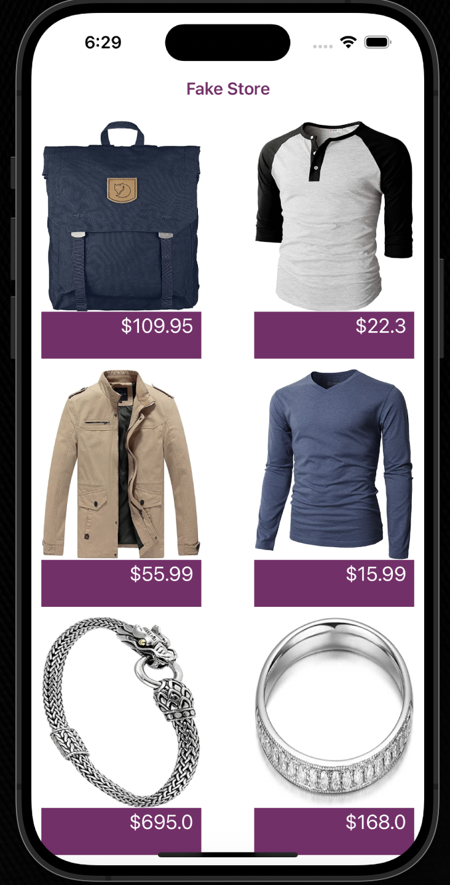
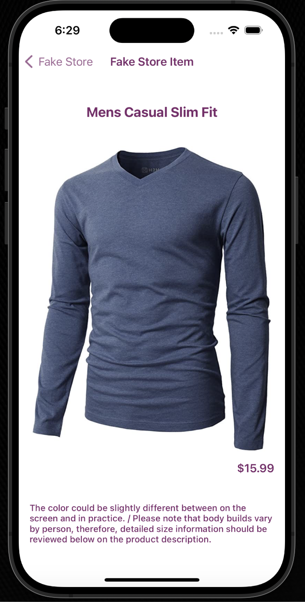

# StoreFrontApp
An iOS storefront app showcasing items in a collection view with detailed item pages.

## Overview
**StoreFrontApp** is a simple iOS app that mimics a storefront fetching API data, allowing users to browse products using a scrollable collection view. Each product is displayed with an image and price, and users can tap on any item to view detailed information on a separate page.

## Features
- Display of products in a grid-style collection view
- Product images and prices visible in the main view
- Detailed product page with additional information on selection
- Smooth scrolling for browsing multiple items
- Supports dynamic content resizing for different screen sizes

## Technologies Used
- **Swift**: Core programming language used to build the app
- **UIKit**: For UI components like `UICollectionView` and navigation
- **Storyboard/XIB**: Interface Builder for designing the collection view and detail screens
- **Auto Layout**: For responsive design on different device sizes

## How It Works

- **Main Collection View**: The main screen displays a list of products in a grid layout using `UICollectionView`. Each cell in the collection shows a product image and its price beneath it. Product data is fetched dynamically from the [Fake Store API](https://fakestoreapi.com/products), which provides product information such as images, descriptions, and prices.
  
- **Detail Page**: When a user taps on a product, they are navigated to a detail view. This view shows a larger image of the product, the product description, and additional details like price and availability. All this data is retrieved from the API for the selected product.

- **Navigation**: The app uses a `UINavigationController` to manage the transitions between the collection view and the product detail view. Tapping on an item pushes the detail view onto the navigation stack, allowing users to easily navigate back to the main product list.

- **API Integration**: The app makes HTTP requests to the [Fake Store API](https://fakestoreapi.com/products) to retrieve product data. The data is parsed and displayed in the collection view and detail page. This allows the app to display dynamic content without hardcoding product information.

- **Scroll Behavior**: The collection view supports smooth vertical scrolling, allowing users to browse through multiple products. The layout is responsive to different screen sizes, ensuring that the app works well on various iOS devices.

## Screenshots

